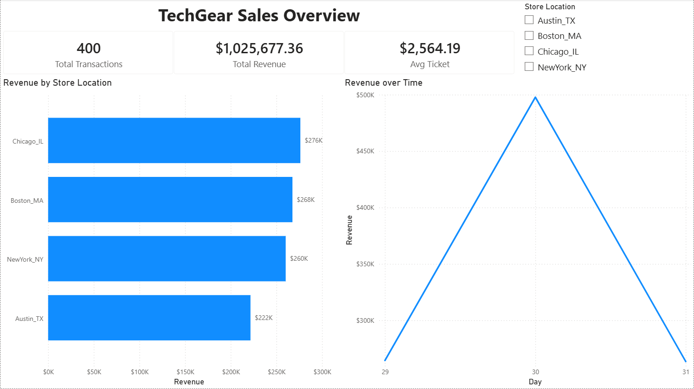

# 🏗️ Modern Data Stack: Local Lakehouse Platform

## 📋 Project Overview
This project simulates a complete end-to-end **Data Engineering Platform** for a retail company ("TechGear"). 

The goal was to move away from manual Excel reporting to an automated **ELT (Extract, Load, Transform)** pipeline. I built a **Local Data Lakehouse** using containerized infrastructure to ingest raw sales data, store it in a Data Lake, transform it in a Data Warehouse, and deliver actionable insights via a Business Intelligence dashboard.

### 🏢 Business Scenario
* **Problem:** Sales data was decentralized in CSV files, leading to delays in reporting (D+3) and lack of historical analysis.
* **Solution:** An automated pipeline that ingests data daily, ensuring data integrity, history tracking (audit), and immediate availability for the C-level dashboard.

---

## 📐 Architecture

The pipeline follows the **Medallion Architecture** (Bronze, Silver, Gold):

graph LR
    A[Python Script] -->|Generates Data| B(MinIO / S3)
    B -->|Bronze Layer| C{Airflow DAGs}
    C -->|Copy & Clean| D[(Postgres DW)]
    D -->|Silver Layer| D
    D -->|SQL Aggregation| E[Gold Layer]
    E -->|Read Data| F[Power BI Dashboard]

1.	Ingestion (Bronze): Python scripts generate synthetic sales data and upload it to MinIO (S3 compatible storage) using Hive-style partitioning (year=YYYY/month=MM/day=DD).
2.	Processing (Silver): Airflow triggers the load from S3 to PostgreSQL. Data is deduplicated (idempotency check) and typed correctly.
3.	Analytics (Gold): SQL transformations calculate KPIs like Total Revenue, Orders by Store, and Daily Trends.
4.	Visualization: Power BI connects directly to the Postgres container to display the executive dashboard.

## 🛠️ Tech Stack

•	Infrastructure: Docker & Docker Compose (running 5 services).

•	Orchestration: Apache Airflow (2.8.1).

•	Data Lake: MinIO (simulating AWS S3).

•	Data Warehouse: PostgreSQL 13.

•	Visualization: Microsoft Power BI.

•	Language: Python 3.9 (Pandas, S3Hooks, PostgresHooks) & SQL.

## 📸 Screenshots

1. Airflow Orchestration (The Pipeline)
The DAGs orchestrating the flow from ingestion to analytics.

2. Executive Dashboard (Power BI)
Final result delivering value to stakeholders.

## 🚀 How to Run Locally

Prerequisites
 •	Docker Desktop installed and running.
 •	Power BI Desktop (optional, for visualization).

Step-by-Step
1.	Clone the repository:
    git clone [https://github.com/YOUR_USER/project-name.git](https://github.com/YOUR_USER/project-name.git)
    cd project-name

2.	Start the Infrastructure:
    docker-compose up -d

This will spin up Airflow (Webserver, Scheduler), Postgres, and MinIO.

3.	Access the Services:
 •	Airflow UI: http://localhost:8080 (User/Pass: admin/admin)
 •	MinIO Console: http://localhost:9001 (User/Pass: minio_admin/minio_password)

4.	Setup Connections (in Airflow):
 •	Postgres: Host: postgres, Login/Pass: airflow, Port: 5432.
 •	AWS (MinIO): Type: Amazon Web Services, Extra: {"endpoint_url": "http://minio:9000"}.

5.	Run the Pipelines:
 •	Unpause and trigger 02_retail_ingestion (Generates Data).
 •	Unpause and trigger 03_silver_loading (Loads to DW).
 •	Unpause and trigger 04_gold_analytics (Calculates KPIs).

6.	Check the Data: Connect via DBeaver or Power BI to localhost:5435 (Postgres).

## 📂 Project Structure

    ├── dags/                          # Airflow DAGs (Python Scripts)
    │   ├── 02_retail_ingestion.py     # Source -> Bronze (MinIO)
    │   ├── 03_silver_loading.py       # Bronze -> Silver (Postgres)
    │   └── 04_gold_analytics.py       # Silver -> Gold (Aggregation)
    ├── docker-compose.yaml            # Infrastructure as Code
    ├── requirements.txt               # Python dependencies
    └── README.md                      # Documentation

## 👤 Author
Glauber Data Science Student & Aspiring Data Engineer https://www.linkedin.com/in/glauberrocha/